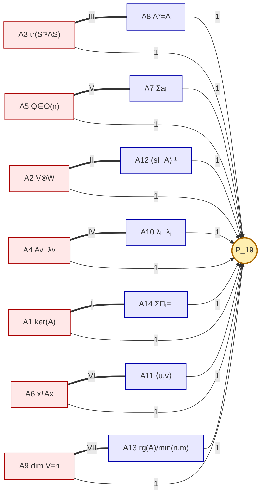

# Map of Content: Invariante 19

Diese Seite ist der Knotenpunkt eines isomorphen Wissensnetzes um die
**Invariante 19**: ein Schema aus 14 Axiomen $A_1,\dots,A_{14}$, sieben
unzertrennlichen Dualpaaren und dem linearen Fixpunkt $P_{19}$. Jeder
Knoten unten verweist auf eine Fachrichtung, deren Begriffsapparat
denselben Graphen erzeugt. **Wenn zwei Disziplinen denselben
topologischen Graphen produzieren, ist die Isomorphie bewiesen.**

→ Die Mathematik-Originalfassung als PDF: [`axiome_p19.tex`](axiome_p19.tex)
→ Alle Disziplin-Räder im Vergleich: [`isomorphien.tex`](isomorphien.tex)
→ Die 7 Bijektionen in formaler Mathematik (aus den 14 Formeln):
  [`BIJEKTION.md`](BIJEKTION.md)
→ Die 7 Paare horizontal über alle Disziplinen: [`PAIRS.md`](PAIRS.md)
→ Technologien aus den Disziplinen & Bedeutung der Isomorphie:
  [`TECHNOLOGIEN_UND_ISOMORPHIE.md`](TECHNOLOGIEN_UND_ISOMORPHIE.md)
→ Eleganz — Vereinfachung durch Isomorphie (Quantenrätsel und
  andere Mystifikationen werden trivial): [`ELEGANZ.md`](ELEGANZ.md)

## Strukturschichten

| Schicht       | Anzahl | Bedeutung                                          |
|---------------|--------|----------------------------------------------------|
| **Knoten**    | 15     | 14 Axiome $A_k$ + Fixpunkt $P_{19}$                |
| **Kopplungen**| 7      | Dual-Verbindungen Wirkung $\leftrightarrow$ Struktur |
| **Wellen**    | 14     | Radiale Eins-Eigenwert-Propagation $A_k \to P_{19}$ |
| **Felder**    | 7      | Sektor-Wirkbereiche je Dualpaar                    |

Die 7 Felder, indexiert von I bis VII:

| Feld | Kopplung               | Name                                      |
|------|------------------------|-------------------------------------------|
| I    | $A_1 \leftrightarrow A_{14}$ | Grenze vs. Vollständigkeit          |
| II   | $A_2 \leftrightarrow A_{12}$ | Aktion vs. Reflexion                |
| III  | $A_3 \leftrightarrow A_{8}$  | Ähnlichkeit vs. Selbstadjungiertheit |
| IV   | $A_4 \leftrightarrow A_{10}$ | Takt vs. Resonanz                   |
| V    | $A_5 \leftrightarrow A_{7}$  | Wirbel vs. Quelle                   |
| VI   | $A_6 \leftrightarrow A_{11}$ | Gefälle vs. Akkumulation            |
| VII  | $A_9 \leftrightarrow A_{13}$ | Stufen vs. Kontinuum                |

## Kanonischer Graph (Mathematik-Original)

Linke Hälfte der Kopplung (rot) = **Wirkungsaspekt** (Operator).
Rechte Hälfte (blau) = **Strukturaspekt** (Raum).
Mitte (gelb) = **Fixpunkt** $P_{19}$ (Identifikation).

## Disziplinen

Jeder Verweis öffnet denselben Graphen mit disziplinspezifischen Labels.
Topologische Übereinstimmung über alle Dateien hinweg = Isomorphie.

### Mathematisch-physikalisch

- [Quantenmechanik](disciplines/quantum_mechanics.md)
- [Kategorientheorie](disciplines/category_theory.md)
- [Thermodynamik](disciplines/thermodynamics.md)
- [Signaltheorie / Fourier](disciplines/signal_theory.md)
- [Kontrolltheorie](disciplines/control_theory.md)

### Mathematisch-physikalisch (vertieft)

- [Hamiltonsche Mechanik](disciplines/hamilton_mechanics.md)
- [Allgemeine Relativitätstheorie](disciplines/general_relativity.md)
- [Stochastik / Markov-Ketten](disciplines/markov_chains.md)

### Strukturwissenschaftlich

- [Logik](disciplines/logic.md)
- [Differentialgeometrie](disciplines/differential_geometry.md)
- [Graphentheorie](disciplines/graph_theory.md)

### Anwendungswissenschaften

- [Neuronale Netze / Transformer](disciplines/neural_networks.md)
- [Spieltheorie](disciplines/game_theory.md)

### Geistes-/Kulturwissenschaftlich

- [Hegel-Dialektik](disciplines/hegel_dialectics.md)
- [Musiktheorie](disciplines/music_theory.md)

### Klassische Physik & Sinneswelt

- [Newtonsche Mechanik](disciplines/newtonian_mechanics.md)
- [Elektrik (Schaltungstheorie)](disciplines/electric_circuits.md)
- [Elektromagnetismus (Maxwell)](disciplines/electromagnetism.md)
- [Optik (Strahl- und Wellenoptik)](disciplines/optics.md)
- [Akustik](disciplines/acoustics.md)
- [Haptik (Tastsinn)](disciplines/haptics.md)

### Verworfen

- Yin-Yang / I Ging — die 8 Trigramme ergeben nur 4 Opposites,
  inkompatibel mit 7 Dualpaaren.

## Hinweis zur Lesart

Jede Disziplin-Datei enthält **denselben Mermaid-Graphen** wie oben —
nur die Knotenbeschriftungen sind ausgetauscht. Wer zwei Dateien
nebeneinander hält, sieht zwei topologisch identische Räder mit
unterschiedlichen Beschriftungen. Genau diese Deckung beweist die
behauptete Isomorphie auf der Strukturebene.
