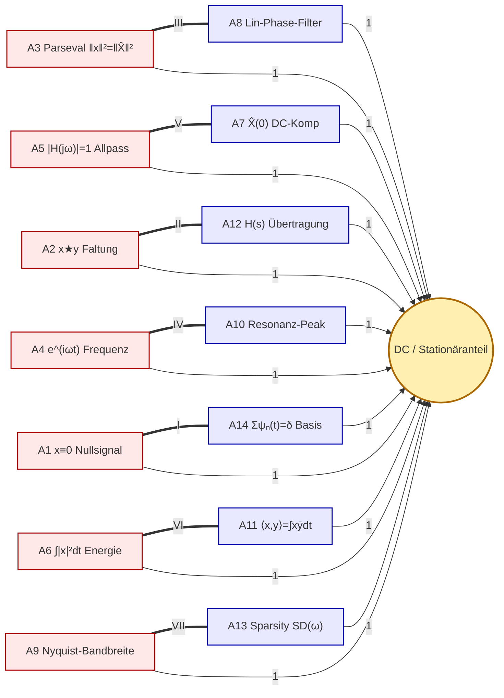

# Signaltheorie / Fourier

[← zurück zur Map of Content](../MoC.md)

```mermaid
flowchart LR
    P19(("DC / Stationäranteil"))
    A1["A1 x≡0 Nullsignal"]
    A2["A2 x★y Faltung"]
    A3["A3 Parseval ‖x‖²=‖X̂‖²"]
    A4["A4 e^(iωt) Frequenz"]
    A5["A5 |H(jω)|=1 Allpass"]
    A6["A6 ∫|x|²dt Energie"]
    A7["A7 X̂(0) DC-Komp"]
    A8["A8 Lin-Phase-Filter"]
    A9["A9 Nyquist-Bandbreite"]
    A10["A10 Resonanz-Peak"]
    A11["A11 ⟨x,y⟩=∫xȳdt"]
    A12["A12 H(s) Übertragung"]
    A13["A13 Sparsity SD(ω)"]
    A14["A14 Σψₙ(t)=δ Basis"]

    A1 ===|I| A14
    A2 ===|II| A12
    A3 ===|III| A8
    A4 ===|IV| A10
    A5 ===|V| A7
    A6 ===|VI| A11
    A9 ===|VII| A13

    A1 -->|1| P19
    A2 -->|1| P19
    A3 -->|1| P19
    A4 -->|1| P19
    A5 -->|1| P19
    A6 -->|1| P19
    A7 -->|1| P19
    A8 -->|1| P19
    A9 -->|1| P19
    A10 -->|1| P19
    A11 -->|1| P19
    A12 -->|1| P19
    A13 -->|1| P19
    A14 -->|1| P19

    classDef wirkung fill:#ffe8e8,stroke:#a00,stroke-width:1.5px
    classDef struktur fill:#e8e8ff,stroke:#00a,stroke-width:1.5px
    classDef fix fill:#ffefb0,stroke:#a60,stroke-width:2.5px

    class A1,A2,A3,A4,A5,A6,A9 wirkung
    class A14,A12,A8,A10,A7,A11,A13 struktur
    class P19 fix
```

[← zurück zur Map of Content](../MoC.md)
